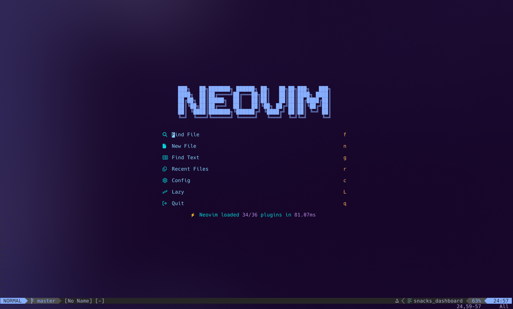

# 🌙 Luccas's Neovim Configuration

This is my personal Neovim setup, configured entirely in Lua. It's designed to be a fast, modern, and efficient environment for development, managed with `lazy.nvim`.



---

## 🔌 Featured Plugins

### Core Functionality
* **[lazy.nvim](https://github.com/folke/lazy.nvim)**: A modern, fast plugin manager for Neovim.
* **[mason.nvim](https://github.com/williamboman/mason.nvim)**: Manages Language Servers, Linters, and Formatters for a consistent development environment across languages.
* **[telescope.nvim](https://github.com/nvim-telescope/telescope.nvim)**: The central fuzzy finder for files, buffers, text, and more.
* **[nvim-treesitter](https://github.com/nvim-treesitter/nvim-treesitter)**: Provides advanced, accurate syntax highlighting and code parsing.
* **[fugitive.vim](https://github.com/tpope/vim-fugitive)**: A premier Git wrapper that allows you to run any Git command directly from Neovim.

### UI & UX
* **[lualine.nvim](https://github.com/nvim-lualine/lualine.nvim)**: A clean and informative statusline.
* **[trouble.nvim](https://github.com/folke/trouble.nvim)**: A dedicated, pretty UI for diagnostics, references, and other lists.
* **Custom Colorscheme**: A personalized color theme for a comfortable viewing experience.
* **[zen-mode.nvim](https://github.com/folke/zen-mode.nvim)**: Provides a distraction-free writing and coding environment.
* **[Snacks.nvim](https://github.com/folke/snacks.nvim)**: Collecton of small QoL plugins.
### Editing & Development Experience
* **[harpoon](https://github.com/ThePrimeagen/harpoon)**: Quickly mark and jump between important files.
* **[undotree](https://github.com/mbbill/undotree)**: Visualizes your undo history as a tree, making it easy to navigate changes.
* **[peek.nvim](https://github.com/toppair/peek.nvim)**: Renders local Markdown files in a floating window.
* **[cloak.nvim](https://github.com/laytan/cloak.nvim)**: An experimental plugin to cloak or hide distracting text using regex patterns.
* **[vimbegood](https://github.com/ThePrimeagen/vimbegood)**: A game to help you practice and improve your Vim motions.
* **Jai Language Support**: Includes syntax highlighting for the Jai programming language.

---

## 🚀 Installation

#### Prerequisites

* Neovim (v0.8.0 or higher)
* Git
* A [Nerd Font](https://www.nerdfonts.com/) installed and enabled in your terminal for icons to render correctly.

#### Steps

1.  **Clone the repository** into your Neovim config directory:
    ```bash
    git clone <your_repository_url> ~/.config/nvim
    ```

2.  **Start Neovim**:
    ```bash
    nvim
    ```lazy.nvim` will automatically bootstrap itself and install all the configured plugins on the first run.

---

## 🔑 Keybindings

The leader key is set to `<Space>`.

All keybindings for this configuration are defined in the `lua/luccas/remap.lua` file.

To easily discover and search all custom mappings, this configuration includes a custom keymap viewer built with Telescope.
* Press `<leader>?` (`Space` + `?`) in Normal mode to open it.
* You can then start typing to filter by plugin, group, or description.

